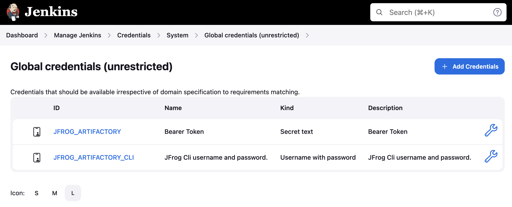
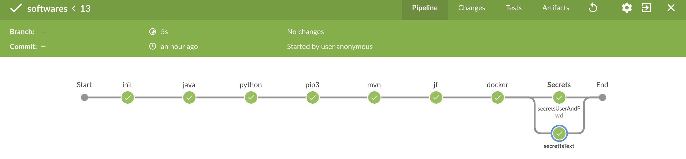

#Jenkins job files

## Run Jenkins
- Create a local folder to save workspace data
``````bash
mkdir -p my-jenkins-data
``````
### Docker image
Docker image with Java 1.7+, [Apache Maven 3.9.x](https://maven.apache.org), [Python 3.9.x](https://www.python.org/downloads/), [JFrog CLI 2.57.x](https://jfrog.com/getcli/)
- Prerequisite: Docker v 25x. 
``````bash
docker run -d -p 7080:8080 --volume $(pwd)/my-jenkins-data:/var/jenkins_home -rm --name jenkins/jenkins:latest &
``````
### WAR file
- Prerequisite: Java 1.7+, [JFrog CLI](https://jfrog.com/getcli/), [Apache Maven](https://maven.apache.org)
``````bash
wget https://get.jenkins.io/war/latest/jenkins.war
java -jar jenkins.war --httpPort=7080 --enable-future-java & 
``````

- Initial setup password
``````bash
cat $(pwd)/my-jenkins-data/secrets/initialAdminPassword
``````
- Turn off user access
``````bash
cat $(pwd)/my-jenkins-data/config.xml | grep useSecurity
``````
- output should be <useSecurity>false</useSecurity> else update true to false.
- restart jenkins http://localhost:7080/exit
    - refer https://wiki.jenkins-ci.org/display/JENKINS/Administering+Jenkins


## Jenkins jobs
- secret credentials

- [software](./software.jenkinsfile)

- [spring-petclinic using JFrog CLI](./spring-petclinic-JFcli.jenkinsfile)


## GitHub 
### Last uncommit
- 1 is last uncommit
``````bash
git reset --hard HEAD~1
git push origin -f
``````
- 4 is last uncommit
``````bash
git reset --hard HEAD~4
git push origin -f
``````

### Remove last add cache
``````bash
git rm -r --cached .
``````

[](https://github.com/krishnamanchikalapudi)
